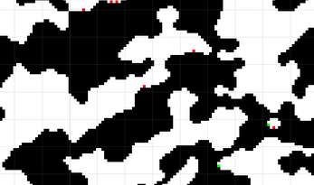
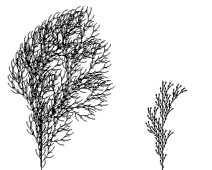
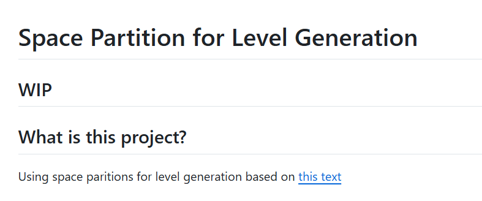

# Artificial Intelligence / Procedural Content Generation

### Procedurally Generated 2D Caves | [github](https://github.com/ramjsandal/PCG) | [itch](https://shebloong.itch.io/random-caves)

Languages/Tools used: C#, Unity, Git

Created a 2D cave generator based on [this paper by Johnson et al.](https://dl.acm.org/doi/10.1145/1814256.1814266) and [this book by Derek Yu](https://www.amazon.com/Spelunky-Boss-Fight-Books-Derek/dp/1940535115). Planned out a random high level path and room layouts using a custom algorithm and then used cellular automata to generate each individual room based on their default layout and their neighboring rooms and then did a smoothing pass over the whole map. 

### L-Systems | [github](https://github.com/ramjsandal/L-Systems) 

Languages/Tools used: C#, Raylib, Git

Generated tree and fractal structures using Aristid Lindenmayer's concept of L-Systems. Wrote the code in C# and visualized using Raylib.

### Level Generation with Space Partitions | [github](https://github.com/ramjsandal/SpacePartition) 

Languages/Tools used: C#, Raylib, XUnit, Git

Generated 2D dungeon levels using a space partitioning method. Written with C#, visualized with Raylib, and tested with XUnit. Still a work in progress.