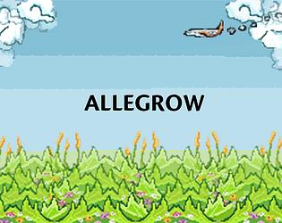
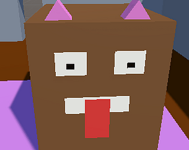
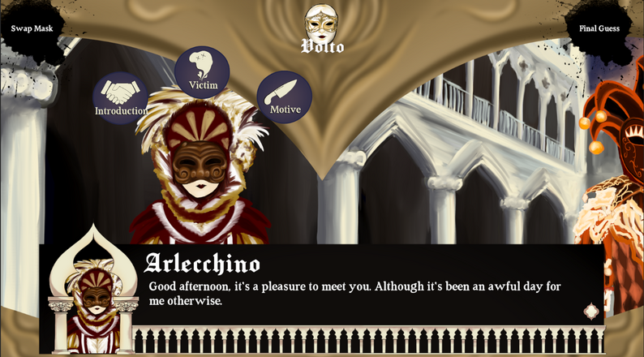

# Games

### Allegrow | [github](https://github.com/ramjsandal/Allegrow/) | [itch](https://shebloong.itch.io/allegrow)

Languages/Tools used: C#, Unity, Git

Worked on a team of 10 people to deliver a plant inspired rhythm game. Personally worked mainly on the movement system and obstacles. 

### IKILLA | [github](https://github.com/ramjsandal/Level-Design-Repository) | [itch](https://shebloong.itch.io/ikilla)

Languages/Tools used: C#, Unity, Git

Programmed and modeled a hidden key puzzle game in an IKEA showroom. Code was written in C# and modeling was done in ProBuilder.

### Nursery Crime | [github](https://github.com/ramjsandal/NurseryCrime) | [itch](https://shebloong.itch.io/nursery-crime)

Languages/Tools used: C#, Unity, Git

Programmed a FPS in Unity using C# where you rescue a baby thats been kidnapped. 

### Beatdown | [github](https://github.com/ramjsandal/Beatdown) 

Languages/Tools used: C#, Unity, MetaXRSDK, Git

Programmed a beatsaber-like game where you punch bags to the beat.

### dARts | [github](https://github.com/ramjsandal/dARts) 

Languages/Tools used: C#, Unity, MetaXRSDK, Git

AR Dart game made with C# in Unity.

### March | [github](https://github.com/ramjsandal/March) | [itch](https://shebloong.itch.io/march) 

Languages/Tools used: C#, Unity, Git

A 2D turn based tactics game where you control a party of a soldier, archer, horseman, and tank to defeat enemies.

### Outbrake | [github](https://github.com/ramjsandal/Outbrake) | [itch](https://shebloong.itch.io/Outbrake) 

Languages/Tools used: C#, Unity, Git

A 2D zombie survival game where you hit zombies with your car. Contains an upgrade system, custom grid system and pathfinding, and unlockable areas. Did pathfinding with Dijkstra's.

### Catnap | [github](https://github.com/yumio7/catnap) | [itch](https://shebloong.itch.io/catnap) 

Languages/Tools used: C#, Unity, Git

A FPS where you play as a cat in their dreams while they fight dogs, mice, lawnmowers, hunters, and a bathtub! Includes an shop where you can purchase better weapons.

### Crystal Carnage | [github](https://github.com/AustinSzema/Roll-for-Retribution) | [itch](https://austinszema.itch.io/demon-time) 

Languages/Tools used: C#, Unity, Git

A physics based FPS where you fight against hordes of enemies. Mainly worked on the spawning system, enemy logic, shop, and various other small features and bugfixes.

### You are the Designer | [github](https://github.com/AustinSzema/gmtk-game-jam-2023) | [itch](https://austinszema.itch.io/demon-time) 

Languages/Tools used: C#, Unity, Git

Puzzle platformer where you construct the level around the player to make it so they can reach the end of the level. Created the level editing system, the level play system, and fixed an assortment of bugs.

### Masked | [itch](https://consistently-nervous.itch.io/masked) 

Languages/Tools used: C#, Unity, Git

Visual Novel murder mystery detective game set at a venetian mask party. I worked on the mask system, its interaction with the dialogue system, and various bugfixes.