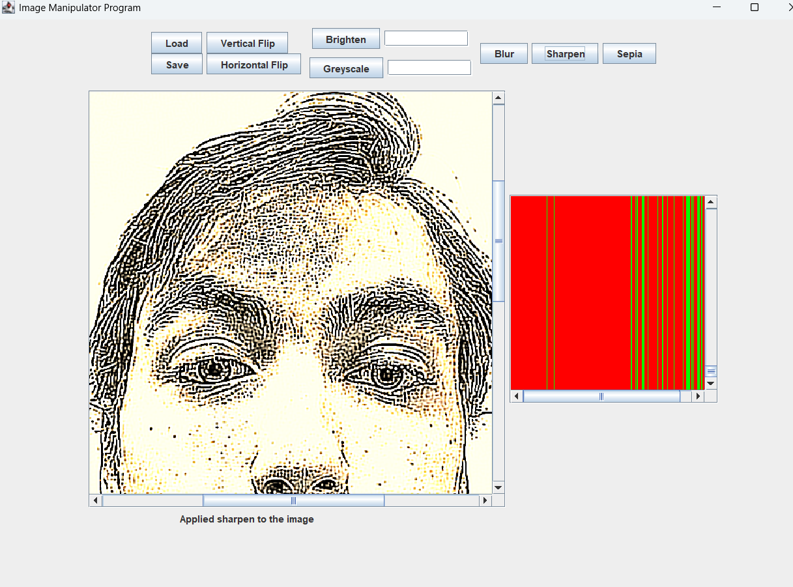

# Other Projects

#### Imageine

##### Java, Java Swing, JUnit, Git

[github](https://github.com/ramjsandal/Imageine/)
A photoshop-like tool where users can load images and apply filters, rotations, and other transformations to the image and export them.
Written using Java and Java Swing, tested using JUnit

