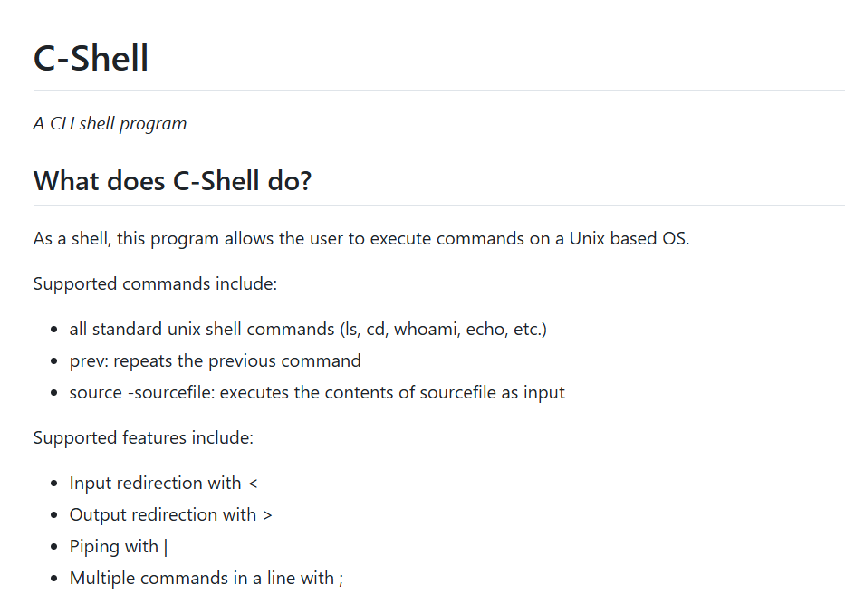
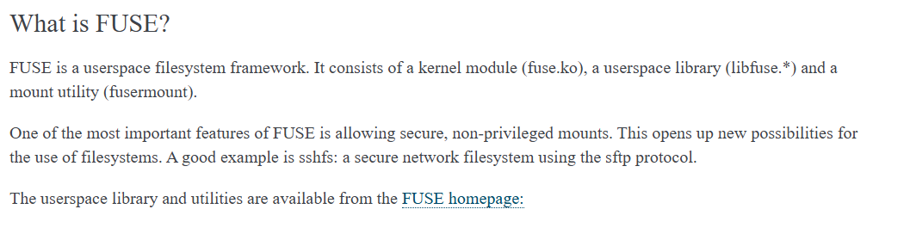

# Other Projects

### Imageine | [github](https://github.com/ramjsandal/Imageine/)

Languages/Tools used: Java, Java Swing, JUnit, Git

A photoshop-like tool where users can load images and apply filters, rotations, and other transformations to the image and export them.
Written using Java and Java Swing, tested using JUnit

### C-Shell | [github](https://github.com/ramjsandal/C-Shell/)

Languages/Tools used: C, Makefile, Git

A program that mimicks the functionality of the linux shell written in C.

### FUSE Filesystem | [github](https://github.com/ramjsandal/FUSEFilesystem/)

Languages/Tools used: C, Makefile, Git

Implementation of the FUSE interface in C.