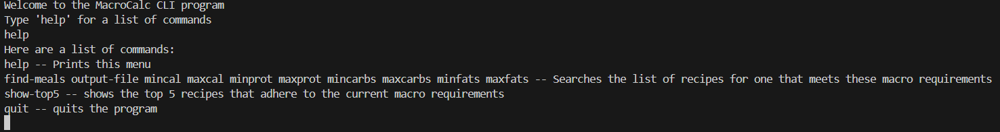
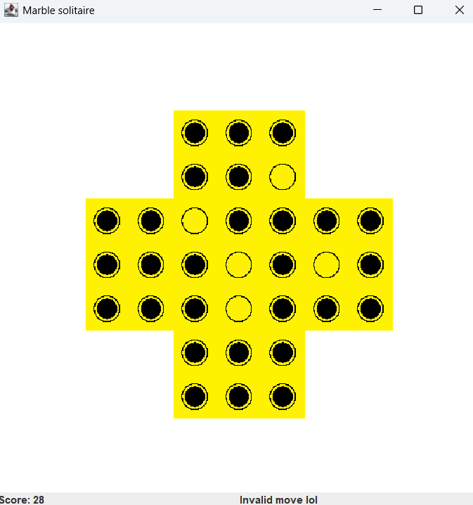

# Other Projects

### VR Presentation Training Application for People with Speech Impediments | [github](https://github.com/nsp5488/VR-Presentation-Training-for-Stuttering) | [demo](https://www.youtube.com/watch?v=XnOVqCA4Q3c&ab_channel=NicholasPatel)

Languages/Tools used: C#, Unity, Git

VR application created to assist users with speech impediments in practicing giving presentations. Used by the Speech-Languaged and hearing center with patients.

### Imageine | [github](https://github.com/ramjsandal/Imageine/)

Languages/Tools used: Java, Java Swing, JUnit, Git

A photoshop-like tool where users can load images and apply filters, rotations, and other transformations to the image and export them.
Written using Java and Java Swing, tested using JUnit

### MacroMeal | [github](https://github.com/ramjsandal/MacroMeal)

Languages/Tools used: Java, Excel, JUnit, Git

Tool that helps users find well reviewed meals from popular recipe websites that fit their macronutrient requirements. Written with Java and currently only supports a TUI. 

### C-Shell | [github](https://github.com/ramjsandal/C-Shell/)

Languages/Tools used: C, Makefile, Git

A program that mimicks the functionality of the linux shell written in C.

### FUSE Filesystem | [github](https://github.com/ramjsandal/FUSEFilesystem/)

Languages/Tools used: C, Makefile, Git

Implementation of the FUSE interface in C.

### Marble Solitaire | [github](https://github.com/ramjsandal/MarbleSolitaire/)

Languages/Tools used: Java, Java Swing, JUnit, Git

Created an implementation of the game Marble Solitaire. Allows for multiple types of boards and includes both a GUI and TUI version.