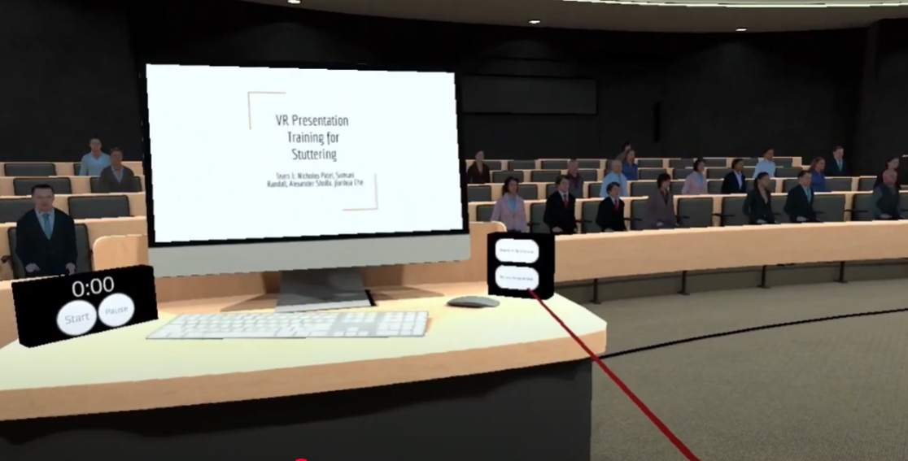
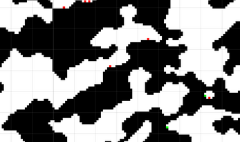

# Projects

This section contains lists of some of my projects with descriptions. I've split them into three sections, games, PCG, and other software projects. Most of my finished games can be found on [my itch.io](https://shebloong.itch.io/), and most of the rest of my projects have their source code publicly available on [my github](https://github.com/ramjsandal/) 

I've put my personal favorite projects here on this page, but I've included extended lists divided into sections on the rest of the site.

### VR Presentation Training Application for People with Speech Impediments | [github](https://github.com/nsp5488/VR-Presentation-Training-for-Stuttering) | [demo](https://www.youtube.com/watch?v=XnOVqCA4Q3c&ab_channel=NicholasPatel)

Languages/Tools used: C#, Unity, Git

VR application created to assist users with speech impediments in practicing giving presentations. Used by the Speech-Language and hearing center with patients.

### Outbrake | [github](https://github.com/ramjsandal/Outbrake) | [itch](https://shebloong.itch.io/Outbrake) 

Languages/Tools used: C#, Unity, Git

A 2D zombie survival game where you hit zombies with your car. Contains an upgrade system, custom grid system and pathfinding, and unlockable areas. Did pathfinding with Dijkstra's.

### Procedurally Generated 2D Caves | [github](https://github.com/ramjsandal/PCG) | [itch](https://shebloong.itch.io/random-caves)

Languages/Tools used: C#, Unity, Git

Created a 2D cave generator based on [this paper by Johnson et al.](https://dl.acm.org/doi/10.1145/1814256.1814266) and [this book by Derek Yu](https://www.amazon.com/Spelunky-Boss-Fight-Books-Derek/dp/1940535115). Planned out a random high level path and room layouts using a custom algorithm and then used cellular automata to generate each individual room based on their default layout and their neighboring rooms and then did a smoothing pass over the whole map.

You can check the sidebar to navigate to the different sections or use the links below:

[Games](https://ramjsandal.github.io/portfolio/projects/games.html)

[AI/PCG](https://ramjsandal.github.io/portfolio/projects/ai.html)

[Other Software Projects](https://ramjsandal.github.io/portfolio/projects/otherProjects.html)

